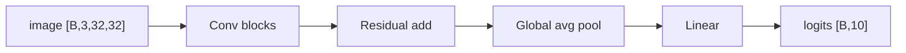

# 01. ResNet18 + CIFAR-10 깊은 복습

> 대상 원본: `vision/01_Intro.pdf`, `vision/02_DNN_CNN.pdf`, `vision/01_ResNet18_CIFAR10.ipynb`, `Day3.md`  
> 목표: CNN/ResNet 논문 아이디어를 코드의 **입력/출력 shape**와 연결해서 이해한다.

---

## 그림으로 먼저 잡기



| 시각 포인트 | shape 변화 | 의미 |
|---|---|---|
| convolution | channel 증가, H/W 감소 가능 | local pattern 추출 |
| residual branch | 같은 shape끼리 더함 | gradient 흐름 보존 |
| classifier | feature vector → class logits | CIFAR-10 분류 |


## 0. 한 장 요약

| 구간 | 코드 객체 | 입력 shape | 출력 shape | 의미 |
|---|---|---:|---:|---|
| 데이터 | `CIFAR10` | 이미지 파일 | `[B, 3, 32, 32]` | RGB 32x32 이미지 배치 |
| 정규화 | `Normalize(mean,std)` | `[B,3,32,32]` | `[B,3,32,32]` | 채널별 평균/표준편차 기준 표준화 |
| stem | `conv1: 3x3, stride=1` | `[B,3,32,32]` | `[B,64,32,32]` | CIFAR용으로 ImageNet stem보다 작게 시작 |
| residual stage | `layer1~4` | feature map | `[B,512,4,4]` | 점점 해상도↓, 채널↑ |
| pooling | `avgpool` | `[B,512,4,4]` | `[B,512,1,1]` | 공간 정보를 전역 평균으로 요약 |
| classifier | `fc` | `[B,512]` | `[B,10]` | CIFAR-10 class logits |

핵심은 이것이다.

```text
이미지 [B,3,32,32]
  └─ Conv/BN/ReLU: 지역 패턴 추출
      └─ Residual blocks: F(x)+x 로 깊어져도 정보/gradient 고속도로 유지
          └─ Global AvgPool: 위치별 feature를 class 판단용 벡터로 압축
              └─ Linear: 10개 클래스 logit
```

---

## 0-1. 기존 Day3 그림 자료

Day3에 이미 들어간 sigmoid/CNN 관련 그림도 함께 보면 좋습니다.


---

## 1. CNN이 하는 일: H/W를 줄이고 C를 늘린다

CNN feature map은 보통 `[B, C, H, W]`다.

- `B`: batch size. 한 번에 처리하는 이미지 개수.
- `C`: channel 수. 처음에는 RGB 3개지만, 중간 feature에서는 “특징 검출기 개수”에 가깝다.
- `H, W`: 공간 해상도.

Day3 노트의 문장처럼:

| 변화 | 직관 |
|---|---|
| `H, W` 감소 | 위치 정보를 더 거칠게 보고, 큰 문맥을 본다. |
| `C` 증가 | 더 많은 종류의 특징을 찾는다. |

예를 들어 CIFAR-10에서 ResNet18은 대략 이렇게 간다.

```text
[B, 3, 32,32]
 -> [B, 64,32,32]   conv1
 -> [B, 64,32,32]   layer1
 -> [B,128,16,16]   layer2, stride=2
 -> [B,256, 8, 8]   layer3, stride=2
 -> [B,512, 4, 4]   layer4, stride=2
 -> [B,512, 1, 1]   global avgpool
 -> [B,10]          fc
```

---

## 2. Convolution shape 공식

Conv2d 출력 크기는 다음 공식으로 계산한다.

```text
H_out = floor((H_in + 2*padding - dilation*(kernel-1) - 1)/stride + 1)
W_out = floor((W_in + 2*padding - dilation*(kernel-1) - 1)/stride + 1)
```

CIFAR용 `conv1 = Conv2d(3,64,kernel_size=3,stride=1,padding=1)`이면:

```text
H_out = (32 + 2*1 - 1*(3-1) - 1)/1 + 1 = 32
W_out = 32
C_out = 64
```

그래서 `[B,3,32,32] -> [B,64,32,32]`가 된다.

---

## 3. 왜 CIFAR에서는 ResNet stem을 바꾸나?

ImageNet용 ResNet은 보통 처음에 `7x7 stride=2 conv + maxpool`을 쓴다. ImageNet 이미지는 보통 224x224라 초반에 줄여도 정보가 꽤 남는다.

하지만 CIFAR-10은 32x32라서 초반에 너무 줄이면 바로 작아진다.

| 입력 | ImageNet stem 사용 시 | 문제 |
|---|---|---|
| `32x32` | `7x7 stride=2` 후 `16x16`, maxpool 후 `8x8` | 초반부터 정보가 너무 사라짐 |
| CIFAR stem | `3x3 stride=1`, maxpool 제거 | 32x32를 유지하며 시작 |

노트북의 핵심 함수는 이런 의도다.

```python
def build_resnet18_for_cifar10(num_classes=10):
    model = models.resnet18(weights=None)
    model.conv1 = nn.Conv2d(3, 64, kernel_size=3, stride=1, padding=1, bias=False)
    model.maxpool = nn.Identity()
    model.fc = nn.Linear(model.fc.in_features, num_classes)
    return model
```

---

## 4. ResNet 논문 핵심: H(x)를 직접 학습하지 말고 F(x)=H(x)-x를 학습

원 논문: **Deep Residual Learning for Image Recognition**.

일반 블록은 목표 함수 `H(x)`를 직접 학습한다.

```text
x ── weight layers ──> H(x)
```

Residual block은 `H(x)` 대신 `F(x) + x`를 만든다.

```text
          ┌──────── identity / projection ────────┐
x ── conv/bn/relu/conv/bn ── F(x) ── (+) ── relu ──> y
          └──────────────────── x ────────────────┘
```

수식:

```text
y = F(x, W) + x
```

차원이 다르면 그냥 더할 수 없다. 그때는 shortcut에도 `1x1 conv`를 둔다.

```text
x:     [B, 64, 32,32]
F(x):  [B,128,16,16]
shortcut(x)도 [B,128,16,16]이어야 덧셈 가능
```

그래서 downsample block에서는 shortcut이 identity가 아니라 projection이다.

---

## 5. “56층이 왜 더 안 좋았나?”에 대한 이해

Day3에 남겨둔 질문의 답은 “단순 vanishing gradient만”은 아니다. ResNet 논문은 이를 **degradation problem**으로 설명한다.

| 현상 | 설명 |
|---|---|
| overfitting | train error는 낮고 test error만 높음 |
| degradation | train error 자체가 깊은 모델에서 더 높아짐 |

깊은 plain network가 정말 좋은 해를 쉽게 찾을 수 있다면, 추가 layer들이 identity를 학습해서 얕은 모델과 최소한 같은 성능을 내야 한다. 그런데 실제로는 identity mapping을 학습하기 어렵다.

Residual block은 “추가 layer가 아무것도 안 해도 되는 상태”를 쉽게 만든다.

```text
원하는 H(x)=x 라면
plain: 여러 conv가 identity를 정확히 배워야 함
residual: F(x)=0이면 됨
```

그래서 `F(x)`가 작은 잔차만 배우는 문제가 되어 optimization이 쉬워진다.

---

## 6. BatchNorm, ReLU, CrossEntropyLoss

### BatchNorm

CNN 중간 feature `[B,C,H,W]`에서 채널별 통계를 잡는다.

```text
각 channel c에 대해 B,H,W 전체 위치의 평균/분산 계산
x_hat = (x - mean_c) / sqrt(var_c + eps)
y = gamma_c * x_hat + beta_c
```

효과:

- activation scale 안정화
- 큰 learning rate 사용 가능
- residual branch와 shortcut이 더해질 때 분포 폭주 완화

### CrossEntropyLoss

모델 출력은 probability가 아니라 logit이다.

```text
logits: [B,10]
labels: [B]
loss = CrossEntropyLoss(logits, labels)
```

`CrossEntropyLoss`는 내부적으로 `log_softmax + NLLLoss`를 한다. 그래서 모델 마지막에 softmax를 붙이지 않는다.

---

## 7. 학습 루프 읽기

노트북 구조:

```python
for images, labels in train_loader:
    images, labels = images.to(device), labels.to(device)
    optimizer.zero_grad(set_to_none=True)
    with autocast(...):
        logits = model(images)          # [B,10]
        loss = criterion(logits, labels)
    scaler.scale(loss).backward()
    scaler.step(optimizer)
    scaler.update()
```

shape 흐름:

```text
images: [B,3,32,32]
labels: [B]             예: [3, 1, 7, ...]
logits: [B,10]          각 class 점수
loss:   scalar          배치 평균 손실
```

`optimizer.zero_grad()`를 안 하면 gradient가 누적된다. PyTorch는 기본적으로 `loss.backward()` 때 `.grad`에 더하기 때문이다.

---

## 8. 평가/Confusion Matrix/Per-class Accuracy

평가에서는 gradient가 필요 없다.

```python
@torch.no_grad()
def evaluate(...):
    model.eval()
    logits = model(images)
    pred = logits.argmax(dim=1)
```

`pred = logits.argmax(dim=1)`:

```text
logits: [B,10]
argmax over class dimension -> [B]
```

Confusion matrix의 행/열 의미는 보통:

```text
row = true label
col = predicted label
```

대각선이 많을수록 좋다.

---

## 9. Activation 시각화: CNN 내부는 “특징 지도”다

노트북의 `capture_activation`, `show_topk_activation_grid`는 특정 layer 출력 feature map을 잡는다.

예: `layer3` 출력이 `[B,256,8,8]`이면:

- `256`: 서로 다른 feature detector
- `8x8`: 이미지의 거친 위치 격자

어떤 channel의 activation map이 밝다는 것은 “그 channel이 찾는 패턴이 해당 위치에 강하게 있다”는 뜻이다.

```text
input image
  └─ layer1: edge/color/simple texture
  └─ layer2: part-like pattern
  └─ layer3: object part / class hint
  └─ layer4: class-specific high-level feature
```

---

## 10. Conv kernel 시각화

첫 conv는 `weight.shape = [64,3,3,3]`이다.

```text
64개 filter
각 filter는 RGB 3채널을 동시에 봄
각 channel kernel 크기는 3x3
```

하나의 필터:

```text
filter[k] = [3,3,3]
R 3x3 + G 3x3 + B 3x3을 합쳐 하나의 activation map 생성
```

깊은 layer의 kernel은 `[out_channels, in_channels, kH, kW]`에서 `in_channels`가 너무 많아 사람이 바로 보기 어렵다. 그래서 평균하거나 일부 channel만 본다.

---

## 11. Grad-CAM: “어디를 보고 맞췄나?”

Grad-CAM은 마지막 conv feature map `A^k`와 class score `y^c`의 gradient를 쓴다.

```text
alpha_k^c = GlobalAveragePool( d y^c / d A^k )
CAM^c = ReLU( sum_k alpha_k^c A^k )
```

코드 관점:

```text
forward hook: activation 저장
backward hook: gradient 저장
class score backward
activation과 gradient를 결합해 heatmap 생성
```

shape 예:

```text
activation: [B,512,4,4]
gradient:   [B,512,4,4]
weights:    [B,512,1,1]  # H,W 평균
cam:        [B,1,4,4] -> upsample -> [B,1,32,32]
```

Grad-CAM은 “모델의 근거”가 아니라 “해당 class score에 민감한 공간 영역”이다. 해석은 조심해야 한다.

---

## 12. 실습 때 확인할 체크리스트

- `images.shape == [B,3,32,32]`
- `labels.shape == [B]`
- `model(images).shape == [B,10]`
- CIFAR용 stem이 `3x3 stride=1`인지
- 마지막 `fc.out_features == 10`인지
- `CrossEntropyLoss` 전에 softmax를 붙이지 않았는지
- CAM layer를 너무 앞쪽으로 잡지 않았는지. 보통 `layer4`가 해석에 적당하다.

---

## 13. 복습 질문

1. 왜 CIFAR-10에서는 ImageNet ResNet stem을 그대로 쓰면 손해인가?
2. `F(x)+x`에서 `F(x)=0`이면 블록은 어떤 함수가 되는가?
3. shortcut과 main branch의 shape이 다르면 왜 `1x1 conv`가 필요한가?
4. `CrossEntropyLoss`의 입력은 probability인가 logit인가?
5. Grad-CAM의 heatmap은 feature map과 gradient 중 무엇을 결합해서 만드는가?
