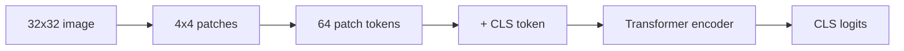
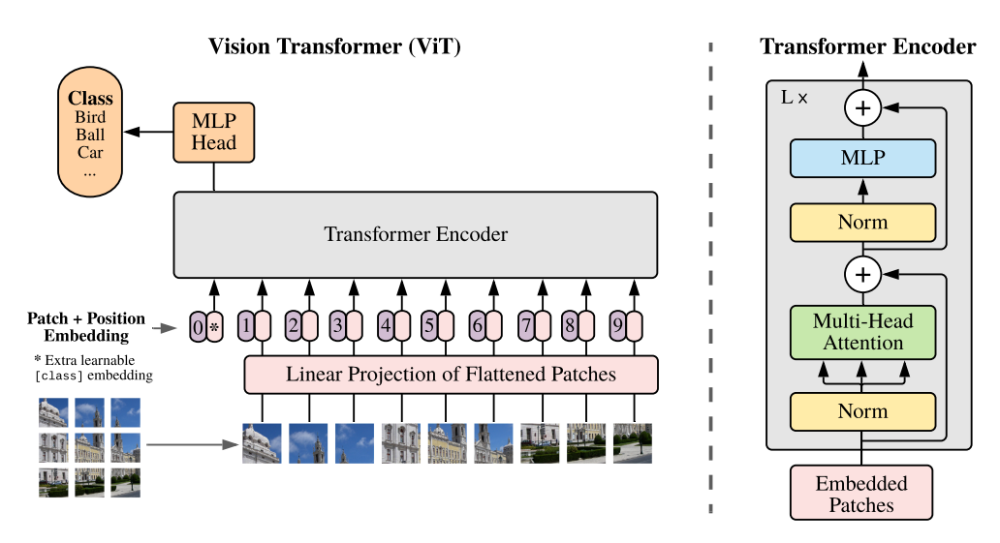

# 02. Vision Transformer + CIFAR-10 깊은 복습

> 대상 원본: `vision/03_Attention.pdf`, `vision/02_ViT_CIFAR10.ipynb`, `Day3.md`  
> 목표: 이미지를 patch token sequence로 바꾸고 Transformer Encoder가 분류하는 과정을 shape 중심으로 이해한다.

---

## 그림으로 먼저 잡기



| CNN과 비교 | CNN | ViT |
|---|---|---|
| 기본 단위 | pixel neighborhood | patch token |
| 관계 모델링 | convolution receptive field | self-attention 전체 token 관계 |
| 위치 정보 | kernel 위치 구조에 내재 | positional embedding 필요 |


## 0. 한 장 요약

| 단계 | 입력 | 출력 | 의미 |
|---|---:|---:|---|
| 이미지 | `[B,3,32,32]` | `[B,3,32,32]` | CIFAR-10 RGB 이미지 |
| patchify | `[B,3,32,32]` | `[B,64,48]` | `4x4` patch 64개, 각 patch는 `3*4*4=48` |
| patch embedding | `[B,64,48]` | `[B,64,64]` | 각 patch를 `dim=64` token으로 projection |
| CLS 추가 | `[B,64,64]` | `[B,65,64]` | 분류 대표 token 추가 |
| position 추가 | `[B,65,64]` | `[B,65,64]` | 순서/위치 정보 주입 |
| Transformer | `[B,65,64]` | `[B,65,64]` | token 간 self-attention |
| head | `[B,64]` | `[B,10]` | CLS token으로 class logits |

```text
image [B,3,32,32]
  -> patches [B,64,48]
  -> tokens [B,64,64]
  -> prepend CLS [B,65,64]
  -> Transformer Encoder x depth
  -> CLS vector [B,64]
  -> logits [B,10]
```

관련 그림: `../../llm_lecture2/assets/vit-structure-BfhCLdlI.png`



---

## 1. ViT 논문 핵심

원 논문: **An Image is Worth 16x16 Words: Transformers for Image Recognition at Scale**.

NLP Transformer는 문장을 token sequence로 본다. ViT는 이미지를 patch sequence로 본다.

```text
문장:  [나는] [밥을] [먹었다]       -> token sequence
이미지: [좌상단 patch] [다음 patch] ... -> patch token sequence
```

CNN과 차이:

| 관점 | CNN | ViT |
|---|---|---|
| 기본 단위 | pixel 근방 convolution | patch token |
| inductive bias | locality, translation equivariance 강함 | 약함 |
| 전역 관계 | 깊게 쌓여야 넓어짐 | attention 한 층에서 전역 연결 |
| 작은 데이터 | 보통 CNN이 유리 | augmentation/pretrain 없으면 불리할 수 있음 |

CIFAR-10 실습 ViT는 논문 대형 ViT보다 훨씬 작다. 목표는 SOTA가 아니라 구조 이해다.

---

## 2. Patch embedding: 이미지가 단어가 되는 지점

설정 예:

```python
ViTConfig(
    image_size=32,
    patch_size=4,
    channels=3,
    dim=64,
    depth=6,
    heads=4,
    num_classes=10,
)
```

패치 개수:

```text
H_patches = 32 / 4 = 8
W_patches = 32 / 4 = 8
N = 8 * 8 = 64
```

패치 하나의 원소 수:

```text
patch_dim = channels * patch_size * patch_size = 3 * 4 * 4 = 48
```

그래서 image 하나는 64개의 48차원 벡터가 된다.

```text
[B, 3, 32, 32]
 -> [B, 8, 8, 3, 4, 4]
 -> [B, 64, 48]
 -> Linear(48 -> 64)
 -> [B, 64, 64]
```

ASCII로 보면:

```text
32x32 image, patch=4
┌──┬──┬──┬──┬──┬──┬──┬──┐
│p1│p2│p3│p4│..│  │  │p8│
├──┼──┼──┼──┼──┼──┼──┼──┤
│p9│..                         
...
└──┴──┴──┴──┴──┴──┴──┴p64┘

각 patch p_i: RGB 4x4 = 48 numbers
Linear: 48 -> dim(64)
```

---

## 3. CLS token과 position embedding

Transformer는 token들의 set처럼 동작하기 쉽다. 그래서 위치를 넣어야 한다.

```python
self.cls_token = nn.Parameter(torch.randn(1, 1, dim))
self.pos_embedding = nn.Parameter(torch.randn(1, num_patches + 1, dim))
```

shape:

```text
patch tokens: [B,64,64]
cls token:    [1,1,64] -> repeat -> [B,1,64]
concat:       [B,65,64]
pos emb:      [1,65,64]
add:          [B,65,64]
```

CLS token은 “이미지를 대표해서 분류 head로 갈 token”이다. BERT의 `[CLS]`와 같은 역할이다.

---

## 4. Self-Attention shape

입력 `x`:

```text
x: [B, N, D] = [B,65,64]
heads = 4
head_dim = D / heads = 16
```

Q,K,V projection:

```text
qkv = Linear(D -> 3D)(x)
q,k,v: [B,N,D]
reshape: [B,heads,N,head_dim] = [B,4,65,16]
```

Attention score:

```text
scores = q @ k.transpose(-2,-1)
q:      [B,4,65,16]
k^T:    [B,4,16,65]
scores: [B,4,65,65]
```

`scores[b,h,i,j]`는 “batch b, head h에서 token i가 token j를 얼마나 볼지”다.

softmax 후 V를 섞는다.

```text
attn: [B,4,65,65]
v:    [B,4,65,16]
out:  [B,4,65,16]
concat heads -> [B,65,64]
```

---

## 5. Pre-LN 구조

노트북의 `PreNorm`은 Transformer block 앞에 LayerNorm을 둔다.

```python
class PreNorm(nn.Module):
    def __init__(self, dim, fn):
        self.norm = nn.LayerNorm(dim)
        self.fn = fn
    def forward(self, x, **kwargs):
        return self.fn(self.norm(x), **kwargs)
```

블록 구조:

```text
x = x + Attention(LN(x))
x = x + MLP(LN(x))
```

Post-LN보다 깊은 모델에서 학습 안정성이 좋은 편이라 현대 Transformer에서 자주 쓴다.

---

## 6. FeedForward/MLP는 token별 비선형 변환

Attention이 token 간 정보를 섞는다면, FFN은 각 token 내부 feature를 변환한다.

```text
x: [B,N,D]
Linear(D -> mlp_dim)
GELU
Dropout
Linear(mlp_dim -> D)
output: [B,N,D]
```

각 token에 같은 MLP를 적용한다. token 간 섞임은 FFN이 아니라 Attention에서 일어난다.

---

## 7. 분류 head

마지막 Transformer 출력:

```text
x: [B,65,64]
cls = x[:,0]     # [B,64]
logits = mlp_head(cls)  # [B,10]
```

왜 평균 pooling이 아니라 CLS인가?

- 논문 ViT는 CLS token 사용.
- CLS가 attention을 통해 다른 patch 정보를 모으도록 학습된다.
- 평균 pooling도 가능하지만 이 노트북은 논문 구조를 따라간다.

---

## 8. Attention map 시각화

노트북의 attention overlay는 마지막 attention에서 CLS가 patch들을 보는 정도를 이미지 격자로 되돌린다.

```text
attn: [B, heads, tokens, tokens]
CLS -> patch attention: attn[:, :, 0, 1:]
mean over heads: [B,64]
reshape: [B,8,8]
upsample: [B,32,32]
```

주의:

- attention이 항상 “설명 가능성”을 의미하지는 않는다.
- 그래도 CLS token이 어떤 patch에 강하게 의존하는지 보는 직관 도구로 좋다.

---

## 9. CNN vs ViT를 코드로 비교

| 질문 | ResNet18 | ViT |
|---|---|---|
| 입력 | `[B,3,32,32]` | `[B,3,32,32]` |
| 중간 표현 | `[B,C,H,W]` feature map | `[B,N,D]` token sequence |
| 공간 축 | H,W 유지 | patch index N으로 펼침 |
| 전역 관계 | receptive field가 커지며 획득 | attention으로 즉시 가능 |
| 출력 | `[B,10]` | `[B,10]` |

ResNet의 channel은 “특징 종류”, ViT의 token은 “이미지 조각”, dim은 “각 조각의 의미 벡터”라고 보면 된다.

---

## 10. 실습 체크리스트

- `num_patches = (image_size // patch_size) ** 2`
- `patch_dim = channels * patch_size ** 2`
- `tokens.shape == [B, num_patches + 1, dim]`
- `dim % heads == 0`
- attention score shape은 `[B, heads, N, N]`
- classifier 입력은 CLS token `[B,dim]`

---

## 11. 복습 질문

1. CIFAR-10에서 `patch_size=4`이면 patch는 몇 개인가?
2. `q @ k.T` 결과가 왜 `[B,heads,N,N]`인가?
3. FFN은 token 간 정보를 섞는가, token 내부 feature를 바꾸는가?
4. position embedding이 없으면 어떤 문제가 생기는가?
5. CNN의 locality bias와 ViT의 global attention은 어떤 trade-off가 있는가?
