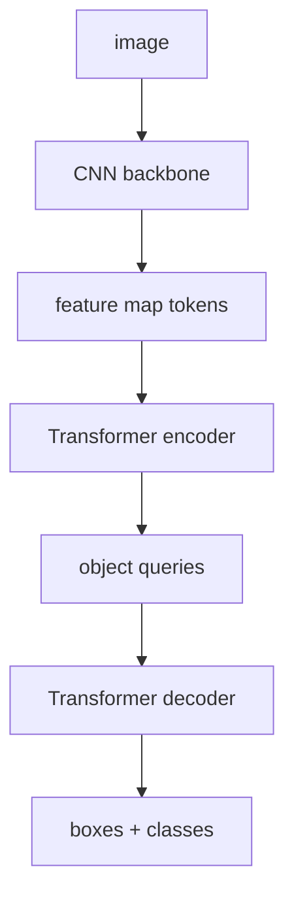
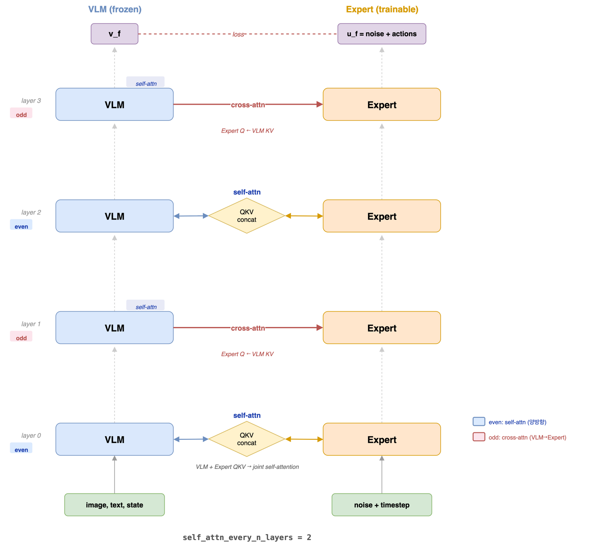

# 03. DETR 깊은 복습

> 대상 원본: `vision/03_Attention.pdf`, `vision/04_Applications.pdf`, `vision/03_DETR.ipynb`, `Day3.md`  
> 목표: Object Detection을 R-CNN 계열과 비교하고, DETR의 set prediction 구조를 코드 출력 shape로 이해한다.

---

## 그림으로 먼저 잡기



| DETR 구성 | 역할 | 직관 |
|---|---|---|
| backbone | 이미지 feature 추출 | CNN으로 visual token 만들기 |
| encoder | 전역 context 섞기 | 모든 위치가 서로 참고 |
| object query | 물체 슬롯 | query 하나가 물체 후보 하나 |
| Hungarian matching | 예측-정답 매칭 | NMS 대신 set prediction |


## 0. 한 장 요약

DETR은 **CNN backbone + Transformer encoder-decoder + object queries**로 object detection을 한다.

```text
image
  -> CNN backbone feature map
  -> flatten + positional encoding
  -> Transformer encoder
  -> learned object queries + decoder
  -> N개 prediction slots
       ├─ class logits: [B, num_queries, num_classes+1]
       └─ boxes:        [B, num_queries, 4]  # cx,cy,w,h normalized
```

노트북의 pretrained DETR 출력은 대표적으로:

| key | shape | 의미 |
|---|---:|---|
| `pred_logits` | `[B,100,92]` | COCO 91 class + no-object |
| `pred_boxes` | `[B,100,4]` | normalized `(cx,cy,w,h)` |

---

## 0-1. Attention 관련 기존 그림

DETR은 detection 문제에 Transformer attention을 가져온 모델입니다. attention layer 감각은 아래 기존 자료와 함께 보면 좋습니다.



---

## 1. 기존 object detection 복습

Day3의 object detection 흐름:

| 계열 | 대표 | 핵심 |
|---|---|---|
| Two-stage | R-CNN, Fast/Faster R-CNN | region proposal 후 분류/박스 보정 |
| One-stage | YOLO, SSD | dense grid/anchor에서 바로 예측 |
| Transformer set prediction | DETR | object query 슬롯 N개가 객체 집합을 예측 |

Two-stage는 후보 영역을 만들고 각 후보를 분류한다.

```text
image -> proposal regions -> crop/feature -> classify + box refine
```

DETR은 N개의 예측 슬롯을 한 번에 낸다.

```text
image -> 100 object queries -> 100 predictions -> confidence 높은 것만 사용
```

---

## 2. DETR 논문 핵심

원 논문: **End-to-End Object Detection with Transformers**.

DETR의 큰 차이:

1. anchor/NMS에 덜 의존한다.
2. detection을 set prediction 문제로 본다.
3. Hungarian matching으로 정답 객체와 prediction slot을 1:1 매칭한다.

훈련 시:

```text
예측 슬롯 100개
정답 객체 M개
Hungarian matching으로 M개 prediction만 정답과 연결
나머지는 no-object class로 학습
```

추론 시 노트북은 이미 학습된 모델을 쓰므로 Hungarian matching은 직접 안 보이고, confidence threshold로 필터링한다.

---

## 3. 입력 전처리

노트북의 transform은 pretrained COCO DETR에 맞춘다.

```python
transform = T.Compose([
    T.Resize(800),
    T.ToTensor(),
    T.Normalize([0.485,0.456,0.406], [0.229,0.224,0.225])
])
```

PIL 이미지가 Tensor가 되면:

```text
PIL: H x W x 3, uint8, 0~255
ToTensor: [3,H,W], float, 0~1
Normalize: [3,H,W], ImageNet mean/std 기준 표준화
batch: [1,3,H',W']
```

`Resize(800)`은 짧은 변/긴 변 규칙이 torchvision 버전에 따라 다를 수 있지만 핵심은 pretrained model 입력 scale에 맞추는 것이다.

---

## 4. box 좌표계: cxcywh -> xyxy -> pixel

DETR 출력 box는 normalized center format이다.

```text
pred_boxes[i] = [cx, cy, w, h]
범위: 0~1
```

시각화하려면 corner format으로 바꾼다.

```python
def box_cxcywh_to_xyxy(x):
    x_c, y_c, w, h = x.unbind(1)
    b = [(x_c - 0.5*w), (y_c - 0.5*h),
         (x_c + 0.5*w), (y_c + 0.5*h)]
    return torch.stack(b, dim=1)
```

shape:

```text
x: [N,4]
return: [N,4]
```

원본 이미지 좌표로 복원:

```python
img_w, img_h = size
scale = torch.tensor([img_w, img_h, img_w, img_h])
boxes_pixel = boxes_xyxy * scale
```

예:

```text
normalized [0.25,0.20,0.50,0.70]
image 640x480
pixel [160,96,320,336]
```

---

## 5. pred_logits 해석

출력:

```text
pred_logits: [1,100,92]
```

- `100`: object query 개수. “최대 100개 객체 후보 슬롯”
- `92`: COCO class + no-object

노트북의 필터링 흐름은 보통:

```python
probas = outputs['pred_logits'].softmax(-1)[0, :, :-1]
keep = probas.max(-1).values > 0.7
```

shape:

```text
outputs['pred_logits']: [1,100,92]
softmax(-1):            [1,100,92]
[0,:,:-1]:              [100,91]  # no-object 제외
max over class:         [100]
keep:                   [100] bool
```

`keep`가 True인 query slot만 그림으로 표시한다.

---

## 6. 왜 NMS가 필요 없어졌나?

YOLO/Faster R-CNN 계열은 여러 anchor/proposal이 같은 객체를 중복 예측할 수 있어 NMS가 필요하다.

DETR은 훈련 때 Hungarian matching으로 “한 정답 객체는 한 슬롯”에 대응되도록 학습한다.

```text
dog 정답 1개
  -> query 17 하나만 dog로 매칭
  -> query 31, 44가 같은 dog를 예측하면 손해
```

그래도 실무 구현에서는 threshold, 후처리, variant에 따라 중복이 완전히 0이라고 보장하지는 않는다. 원 개념은 NMS-free end-to-end detection이다.

---

## 7. CNN backbone + Transformer의 역할 분담

```text
image [B,3,H,W]
 -> ResNet backbone: [B,C,H/32,W/32]
 -> 1x1 conv projection: [B,d,H/32,W/32]
 -> flatten: [B,HW,d]
 -> encoder: image tokens contextualized
 -> decoder: object queries ask image tokens
```

역할:

| 구성 | 역할 |
|---|---|
| CNN backbone | local visual feature 추출 |
| positional encoding | flatten 후 위치 정보 보존 |
| encoder | 이미지 token 간 전역 관계 섞기 |
| object query | “객체 하나를 찾는 슬롯” |
| decoder cross-attention | query가 이미지 feature에서 필요한 위치를 참조 |

---

## 8. 시각화 함수 `plot_results`

입력:

```text
PIL image
probas[keep]: [K,91]
boxes[keep]:  [K,4] pixel xyxy
```

각 detection:

```text
label = probas.argmax(-1)
score = probas.max(-1)
box = [xmin,ymin,xmax,ymax]
```

그림에는 rectangle과 label/score를 표시한다.

---

## 9. Attention 시각화는 무엇을 보는가?

DETR attention은 두 종류가 중요하다.

| attention | 의미 |
|---|---|
| encoder self-attention | 이미지 위치끼리 서로 참조 |
| decoder cross-attention | object query가 이미지 위치를 참조 |

object query별 cross-attention을 보면 “이 query가 어떤 물체 위치를 보고 예측했는지”를 대략 볼 수 있다.

```text
query 17: cat box를 예측
cross-attention heatmap이 cat 주변에 집중될 수 있음
```

---

## 10. 실습 체크리스트

- 입력 tensor는 `[1,3,H,W]`
- `pred_logits`는 `[1,100,num_classes+1]`
- `pred_boxes`는 `[1,100,4]`, normalized cxcywh
- no-object class는 confidence 계산에서 제외
- box 시각화 전 `cxcywh -> xyxy -> pixel` 변환
- DETR은 query slot 기반 set prediction이라는 점을 기억

---

## 11. 복습 질문

1. DETR의 `num_queries=100`은 “객체가 반드시 100개”라는 뜻인가?
2. `pred_boxes`의 4개 값은 pixel 좌표인가 normalized 좌표인가?
3. Hungarian matching은 왜 NMS-free detection과 연결되는가?
4. decoder의 object query는 이미지 feature와 어떤 attention을 하는가?
5. `pred_logits[:, :, :-1]`에서 마지막 class를 왜 제외하는가?
