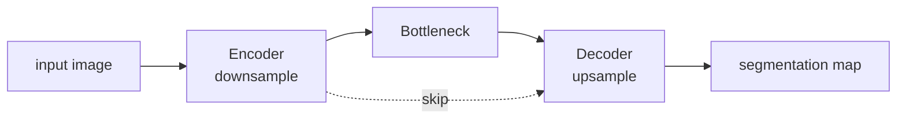

# 04. U-Net + Segmentation 깊은 복습

> 대상 원본: `vision/04_Applications.pdf`, `vision/04_Unet.ipynb`, `Day3.md`  
> 목표: semantic segmentation과 U-Net 코드를 픽셀 단위 입출력 shape로 이해한다.

---

## 그림으로 먼저 잡기



| U-Net 그림에서 봐야 할 것 | 의미 | shape 감각 |
|---|---|---|
| down path | semantic feature 추출 | H/W 감소, channel 증가 |
| skip connection | 위치 정보 복원 | 같은 해상도 feature concat |
| up path | pixel-level 예측 | H/W 증가, class map 출력 |


## 0. 한 장 요약

U-Net은 이미지 전체를 하나의 class로 분류하지 않고, **각 pixel의 class/mask**를 예측한다.

```text
input image: [B,1,128,128]
model output logits: [B,1,128,128]
sigmoid -> probability: [B,1,128,128]
threshold -> mask: [B,1,128,128]
```

분류와 segmentation 차이:

| task | 입력 | 출력 | 의미 |
|---|---:|---:|---|
| Classification | `[B,C,H,W]` | `[B,num_classes]` | 이미지 전체 class |
| Detection | `[B,C,H,W]` | boxes + classes | 객체 위치 + class |
| Segmentation | `[B,C,H,W]` | `[B,K,H,W]` | pixel별 class/logit |

---

## 1. U-Net 논문 핵심

원 논문: **U-Net: Convolutional Networks for Biomedical Image Segmentation**.

핵심 구조:

```text
Encoder / contracting path       Decoder / expansive path

[128x128] ──conv──> [128x128]
    │ pool                 ▲ upconv + skip
[64x64]  ──conv──> [64x64]
    │ pool                 ▲ upconv + skip
[32x32]  ──conv──> [32x32]
    │ pool                 ▲ upconv + skip
[16x16]  ──conv──> [16x16]
    │ pool                 ▲ upconv + skip
            bottleneck [8x8]
```

왜 skip connection이 필요한가?

- encoder 깊은 층은 의미 정보가 강하지만 위치가 거칠다.
- decoder는 해상도를 복원하지만, 경계/세부 위치 정보가 부족하다.
- 같은 해상도의 encoder feature를 decoder에 붙이면 세부 위치를 회복한다.

---

## 2. SyntheticCircleDataset

노트북은 실제 의료 데이터 대신 원 모양 synthetic mask를 만든다.

```python
class SyntheticCircleDataset(Dataset):
    def __getitem__(self, idx):
        image = ... # [1,H,W]
        mask = ...  # [1,H,W], 0 또는 1
        return image, mask
```

DataLoader 후:

```text
imgs:  [B,1,128,128]
masks: [B,1,128,128]
```

여기서 `1` channel은 grayscale 이미지다. RGB면 `[B,3,H,W]`가 된다.

---

## 3. Binary segmentation loss: BCEWithLogitsLoss

출력은 sigmoid 전 logit이다.

```text
logits: [B,1,H,W]
masks:  [B,1,H,W], float 0/1
loss = BCEWithLogitsLoss(logits, masks)
```

`BCEWithLogitsLoss`는 내부에서 sigmoid를 포함한다.

```text
logit z -> sigmoid(z) = p
BCE = - y log(p) - (1-y) log(1-p)
```

그래서 학습 중 모델 마지막에 sigmoid를 붙이지 않는다. 시각화/추론 때만 sigmoid를 적용한다.

---

## 4. DoubleConv

일반 U-Net block:

```python
class DoubleConv(nn.Module):
    def __init__(self, in_ch, out_ch):
        self.net = nn.Sequential(
            nn.Conv2d(in_ch, out_ch, 3, padding=1),
            nn.BatchNorm2d(out_ch),
            nn.ReLU(inplace=True),
            nn.Conv2d(out_ch, out_ch, 3, padding=1),
            nn.BatchNorm2d(out_ch),
            nn.ReLU(inplace=True),
        )
```

`kernel=3, padding=1, stride=1`이면 H,W는 유지된다.

```text
[B,in_ch,H,W] -> [B,out_ch,H,W]
```

---

## 5. Down path shape

예: base channel 64, 입력 `[B,1,128,128]`.

```text
x1 = inc(x)       [B, 64,128,128]
x2 = down1(x1)    [B,128, 64, 64]
x3 = down2(x2)    [B,256, 32, 32]
x4 = down3(x3)    [B,512, 16, 16]
x5 = down4(x4)    [B,512,  8,  8]  # bilinear면 factor 때문에 512일 수 있음
```

Down은 보통:

```text
MaxPool2d(2): H,W 절반
DoubleConv: channel 증가
```

---

## 6. Up path shape와 concatenation

Up은 해상도를 2배로 키운 뒤 encoder feature와 channel 방향으로 붙인다.

```text
up(x5):      [B,512,16,16]
skip x4:     [B,512,16,16]
concat:      [B,1024,16,16]
DoubleConv:  [B,256,16,16]
```

중요: concat은 spatial shape이 같아야 한다.

```text
torch.cat([x_skip, x_up], dim=1)
# dim=1은 channel 축
```

ASCII:

```text
encoder x3 [B,256,32,32] ───────────────┐
                                        concat -> conv -> decoder feature
lower feature [B,512,16,16] -> up [B,256,32,32] ┘
```

---

## 7. OutConv

마지막은 pixel별 binary logit을 낸다.

```python
class OutConv(nn.Module):
    def __init__(self, in_ch, out_ch):
        self.conv = nn.Conv2d(in_ch, out_ch, kernel_size=1)
```

`1x1 conv`는 각 pixel 위치에서 channel을 섞어 output channel 수를 맞춘다.

```text
[B,64,128,128] -> [B,1,128,128]
```

multi-class segmentation이면 `out_ch = num_classes`, 출력은 `[B,K,H,W]`, loss는 `CrossEntropyLoss`, target은 `[B,H,W]` class index다.

---

## 8. 학습 루프

```python
for imgs, masks in train_loader:
    imgs, masks = imgs.to(device), masks.to(device)
    optimizer.zero_grad()
    logits = model(imgs)
    loss = criterion(logits, masks)
    loss.backward()
    optimizer.step()
```

shape:

```text
imgs:   [B,1,128,128]
masks:  [B,1,128,128]
logits: [B,1,128,128]
loss:   scalar
```

---

## 9. 추론/시각화

```python
logits = model(imgs)
probs = torch.sigmoid(logits)
preds = (probs > 0.5).float()
```

의미:

| 값 | 의미 |
|---|---|
| `logits` | sigmoid 전 점수. 음수면 배경 쪽, 양수면 원 쪽 |
| `probs` | 0~1 확률처럼 해석 가능한 값 |
| `preds` | threshold 후 binary mask |

실패 양상:

| 증상 | 가능한 원인 |
|---|---|
| 원 전체를 못 찾음 | 학습 부족, loss 감소 안 함 |
| 경계가 흐림 | decoder upsample/skip 정보 부족 |
| 전부 배경 | class imbalance, threshold, logit scale 문제 |
| shape error | concat 전 H,W 불일치 |

---

## 10. Segmentation과 Detection의 차이

| 구분 | Detection | Segmentation |
|---|---|---|
| 출력 | box 좌표 + class | pixel mask |
| 위치 표현 | 대략적 rectangle | 픽셀 단위 |
| 예시 | DETR | U-Net |
| loss | classification + box loss | pixel-wise BCE/CE/Dice |

U-Net은 “어디에 객체가 있는가”를 box가 아니라 mask로 직접 말한다.

---

## 11. 실습 체크리스트

- binary mask dtype은 float인지
- mask 값은 0/1인지
- `logits.shape == masks.shape`인지
- `BCEWithLogitsLoss` 전 sigmoid를 붙이지 않았는지
- concat 전 skip/up feature의 H,W가 같은지
- 마지막 channel 수가 binary면 1인지

---

## 12. 복습 질문

1. U-Net에서 skip connection은 왜 같은 해상도끼리 연결하는가?
2. segmentation 출력 `[B,1,H,W]`와 classification 출력 `[B,10]`은 무엇이 다른가?
3. `BCEWithLogitsLoss`를 쓸 때 모델 끝에 sigmoid를 넣으면 왜 중복인가?
4. `torch.cat(..., dim=1)`은 어떤 축을 붙이는가?
5. `1x1 conv`는 spatial 정보를 섞는가, channel 정보를 섞는가?
