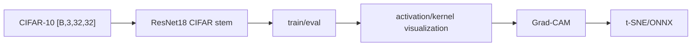

# Vision Practice 01. ResNet18 CIFAR-10 코드 학습 가이드

- 대상 원본: `vision/01_ResNet18_CIFAR10.ipynb`
- 목표: CIFAR-10 입력을 ResNet18에 맞게 학습하고 activation, kernel, Grad-CAM, t-SNE, ONNX까지 CNN 실습 흐름을 이해한다.

## 1. 전체 흐름

## 2. Shape / 데이터 구조 표

| 객체 | shape / 구조 | 의미 |
|---|---:|---|
| `image batch` | `[B,3,32,32]` | CIFAR-10 RGB 입력 |
| `conv feature` | `[B,C,H,W]` | layer별 activation map |
| `logits` | `[B,10]` | 10개 class 점수 |
| `Grad-CAM` | `[H,W]` | target class 근거 heatmap |
| `fc feature` | `[B,512]` | t-SNE에 넣는 representation |

## 3. Cell range map

| 셀 | 역할 | 보는 것 |
|---:|---|---|
| 0-3 | setup/seed/device | 패키지 설치와 재현성 고정 |
| 4-6 | Dataset/정규화/시각화 | CIFAR-10 loader와 denorm |
| 7-14 | ResNet18 정의/학습/로드 | 32x32용 stem과 checkpoint |
| 15-18 | 평가/activation map | 정분류/오분류와 layer activation |
| 19-22 | kernel/Grad-CAM | conv filter와 class activation heatmap |
| 23-28 | 실험 정리/t-SNE/ONNX | feature space와 모델 export |

## 4. Cell-by-cell 학습 메모

### Cells 0-3 — setup/seed/device
- 핵심 관찰: 패키지 설치와 재현성 고정
- 실행 결과보다 “어떤 객체가 다음 단계 입력이 되는가”를 먼저 확인한다.

### Cells 4-6 — Dataset/정규화/시각화
- 핵심 관찰: CIFAR-10 loader와 denorm
- 실행 결과보다 “어떤 객체가 다음 단계 입력이 되는가”를 먼저 확인한다.

### Cells 7-14 — ResNet18 정의/학습/로드
- 핵심 관찰: 32x32용 stem과 checkpoint
- 실행 결과보다 “어떤 객체가 다음 단계 입력이 되는가”를 먼저 확인한다.

### Cells 15-18 — 평가/activation map
- 핵심 관찰: 정분류/오분류와 layer activation
- 실행 결과보다 “어떤 객체가 다음 단계 입력이 되는가”를 먼저 확인한다.

### Cells 19-22 — kernel/Grad-CAM
- 핵심 관찰: conv filter와 class activation heatmap
- 실행 결과보다 “어떤 객체가 다음 단계 입력이 되는가”를 먼저 확인한다.

### Cells 23-28 — 실험 정리/t-SNE/ONNX
- 핵심 관찰: feature space와 모델 export
- 실행 결과보다 “어떤 객체가 다음 단계 입력이 되는가”를 먼저 확인한다.

## 5. 꼭 붙잡을 개념

- ImageNet용 ResNet stem을 그대로 쓰면 32x32 입력에서 초반 downsample이 과할 수 있어 CIFAR용 stem 조정이 중요하다.
- activation map은 layer가 깊어질수록 공간 해상도는 줄고 channel 의미는 추상화된다.
- Grad-CAM은 target class score에 대한 feature map gradient를 이용해 중요한 위치를 시각화한다.

## 6. 실수 포인트

- 정규화된 이미지를 그대로 그리면 색이 이상하므로 denorm 후 시각화한다.
- model.train()/eval() 전환을 잊으면 BatchNorm/Dropout 동작이 달라진다.
- Grad-CAM hook은 사용 후 제거하지 않으면 중복 등록될 수 있다.

## 7. 복습 체크리스트

- `image batch`의 `[B,3,32,32]`가 어느 단계에서 만들어지고 다음 단계에서 어떻게 쓰이는지 설명할 수 있는가?
- `conv feature`의 `[B,C,H,W]`가 어느 단계에서 만들어지고 다음 단계에서 어떻게 쓰이는지 설명할 수 있는가?
- `logits`의 `[B,10]`가 어느 단계에서 만들어지고 다음 단계에서 어떻게 쓰이는지 설명할 수 있는가?
- `Grad-CAM`의 `[H,W]`가 어느 단계에서 만들어지고 다음 단계에서 어떻게 쓰이는지 설명할 수 있는가?
- notebook을 실행하지 않아도 전체 data flow를 그림으로 다시 그릴 수 있는가?
