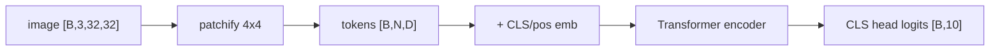

# Vision Practice 02. ViT CIFAR-10 코드 학습 가이드

<!-- aisp-exam-practice-notice -->
> **시험 대비 모드:** 오른쪽에는 원본 전체 코드 대신 핵심 셀을 `## 정답 입력`으로 비운 실습본이 표시됩니다.
> 원본은 `vision/02_ViT_CIFAR10.ipynb`, 정답과 출제 의도는 `study_notes/exam_answers/vision_code_answers.md`에서 확인합니다.

- 대상 원본: `vision/02_ViT_CIFAR10.ipynb`
- 목표: CIFAR-10 이미지를 patch token sequence로 바꾸고 CLS token으로 분류하는 ViT 학습/시각화 흐름을 이해한다.

## 1. 전체 흐름

## 2. Shape / 데이터 구조 표

| 객체 | shape / 구조 | 의미 |
|---|---:|---|
| `image batch` | `[B,3,32,32]` | CIFAR-10 입력 |
| `patches` | `[B,N,patch_dim]` | N=(32/patch)^2 |
| `tokens` | `[B,N+1,D]` | CLS 포함 token sequence |
| `attention` | `[B,H,N+1,N+1]` | head별 token attention |
| `logits` | `[B,10]` | 분류 결과 |

## 3. Cell range map

| 셀 | 역할 | 보는 것 |
|---:|---|---|
| 0-3 | setup/import | einops, torchinfo, seed/device |
| 4-6 | 데이터/denorm | CIFAR-10 loader와 시각화 |
| 7-12 | ViT 구성 | PatchEmbedding, PreNorm, Attention, MLP, CLS token |
| 13-22 | 학습/평가/checkpoint | train/eval loop와 resume |
| 23-28 | CLS attention/오분류 분석 | CLS가 어떤 patch를 보는지 해석 |
| 29-30 | ONNX export | Netron으로 patch/encoder/head 구조 확인 |

## 4. Cell-by-cell 학습 메모

### Cells 0-3 — setup/import
- 핵심 관찰: einops, torchinfo, seed/device
- 실행 결과보다 “어떤 객체가 다음 단계 입력이 되는가”를 먼저 확인한다.

### Cells 4-6 — 데이터/denorm
- 핵심 관찰: CIFAR-10 loader와 시각화
- 실행 결과보다 “어떤 객체가 다음 단계 입력이 되는가”를 먼저 확인한다.

### Cells 7-12 — ViT 구성
- 핵심 관찰: PatchEmbedding, PreNorm, Attention, MLP, CLS token
- 실행 결과보다 “어떤 객체가 다음 단계 입력이 되는가”를 먼저 확인한다.

### Cells 13-22 — 학습/평가/checkpoint
- 핵심 관찰: train/eval loop와 resume
- 실행 결과보다 “어떤 객체가 다음 단계 입력이 되는가”를 먼저 확인한다.

### Cells 23-28 — CLS attention/오분류 분석
- 핵심 관찰: CLS가 어떤 patch를 보는지 해석
- 실행 결과보다 “어떤 객체가 다음 단계 입력이 되는가”를 먼저 확인한다.

### Cells 29-30 — ONNX export
- 핵심 관찰: Netron으로 patch/encoder/head 구조 확인
- 실행 결과보다 “어떤 객체가 다음 단계 입력이 되는가”를 먼저 확인한다.

## 5. 꼭 붙잡을 개념

- ViT는 CNN feature map 대신 patch를 token처럼 취급한다.
- CLS token은 전체 이미지 정보를 모아 classification head로 전달되는 대표 token이다.
- patch_size가 작을수록 token 수 N이 늘고 attention 비용은 N^2로 증가한다.

## 6. 실수 포인트

- [B,C,H,W]와 [B,N,D] 전환 지점을 놓치면 ViT 구조가 헷갈린다.
- positional embedding이 없으면 patch 순서/위치 정보가 약해진다.
- attention map을 원본 이미지에 올릴 때 patch grid 해상도와 원본 해상도를 구분한다.

## 7. 복습 체크리스트

- `image batch`의 `[B,3,32,32]`가 어느 단계에서 만들어지고 다음 단계에서 어떻게 쓰이는지 설명할 수 있는가?
- `patches`의 `[B,N,patch_dim]`가 어느 단계에서 만들어지고 다음 단계에서 어떻게 쓰이는지 설명할 수 있는가?
- `tokens`의 `[B,N+1,D]`가 어느 단계에서 만들어지고 다음 단계에서 어떻게 쓰이는지 설명할 수 있는가?
- `attention`의 `[B,H,N+1,N+1]`가 어느 단계에서 만들어지고 다음 단계에서 어떻게 쓰이는지 설명할 수 있는가?
- notebook을 실행하지 않아도 전체 data flow를 그림으로 다시 그릴 수 있는가?
