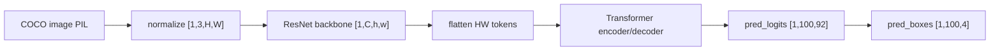

# Vision Practice 03. DETR 코드 학습 가이드

- 대상 원본: `vision/03_DETR.ipynb`
- 목표: DETR의 Backbone CNN, Transformer encoder/decoder, object query, class/box prediction과 attention 시각화 흐름을 이해한다.

## 1. 전체 흐름

## 2. Shape / 데이터 구조 표

| 객체 | shape / 구조 | 의미 |
|---|---:|---|
| `input image` | `[1,3,H,W]` | 정규화된 COCO 이미지 |
| `backbone feature` | `[1,C,h,w]` | CNN spatial feature |
| `encoder tokens` | `[1,h*w,D]` | feature map을 펼친 sequence |
| `pred_logits` | `[1,100,92]` | 100 queries, COCO class + no-object |
| `pred_boxes` | `[1,100,4]` | normalized cx,cy,w,h |
| `attention map` | `[h*w,h*w] 또는 [100,h*w]` | self/cross attention |

## 3. Cell range map

| 셀 | 역할 | 보는 것 |
|---:|---|---|
| 0-3 | DETR 개요/setup | 필요 패키지와 모델 분석 포인트 |
| 4-9 | COCO label/transform/plot | class 이름, 이미지 정규화, box 변환 |
| 10-13 | pretrained DETR 로드/구조 | ResNet50 backbone과 transformer 구조 확인 |
| 14-19 | COCO 이미지 추론 | logits/boxes filtering 후 시각화 |
| 20-23 | hook과 decoder cross-attention | object query가 보는 spatial token heatmap |
| 24-33 | encoder self-attention/Visualizer | HWxHW attention을 2D 공간으로 복원 |

## 4. Cell-by-cell 학습 메모

### Cells 0-3 — DETR 개요/setup
- 핵심 관찰: 필요 패키지와 모델 분석 포인트
- 실행 결과보다 “어떤 객체가 다음 단계 입력이 되는가”를 먼저 확인한다.

### Cells 4-9 — COCO label/transform/plot
- 핵심 관찰: class 이름, 이미지 정규화, box 변환
- 실행 결과보다 “어떤 객체가 다음 단계 입력이 되는가”를 먼저 확인한다.

### Cells 10-13 — pretrained DETR 로드/구조
- 핵심 관찰: ResNet50 backbone과 transformer 구조 확인
- 실행 결과보다 “어떤 객체가 다음 단계 입력이 되는가”를 먼저 확인한다.

### Cells 14-19 — COCO 이미지 추론
- 핵심 관찰: logits/boxes filtering 후 시각화
- 실행 결과보다 “어떤 객체가 다음 단계 입력이 되는가”를 먼저 확인한다.

### Cells 20-23 — hook과 decoder cross-attention
- 핵심 관찰: object query가 보는 spatial token heatmap
- 실행 결과보다 “어떤 객체가 다음 단계 입력이 되는가”를 먼저 확인한다.

### Cells 24-33 — encoder self-attention/Visualizer
- 핵심 관찰: HWxHW attention을 2D 공간으로 복원
- 실행 결과보다 “어떤 객체가 다음 단계 입력이 되는가”를 먼저 확인한다.

## 5. 꼭 붙잡을 개념

- DETR의 100 queries는 실제 객체 100개가 아니라 후보 slot 수다. threshold 후 K개만 표시된다.
- pred_boxes는 픽셀 좌표가 아니라 [0,1] normalized cxcywh라서 시각화 전 xyxy pixel로 변환한다.
- encoder self-attention은 image token끼리, decoder cross-attention은 object query가 image token을 보는 관계다.

## 6. 실수 포인트

- no-object class를 제외하지 않으면 confidence 해석이 틀어진다.
- feature map 좌표와 원본 이미지 좌표는 downsample/resize 때문에 다르다.
- attention hook을 여러 번 등록하면 중복 캡처와 메모리 증가가 생긴다.

## 7. 복습 체크리스트

- `input image`의 `[1,3,H,W]`가 어느 단계에서 만들어지고 다음 단계에서 어떻게 쓰이는지 설명할 수 있는가?
- `backbone feature`의 `[1,C,h,w]`가 어느 단계에서 만들어지고 다음 단계에서 어떻게 쓰이는지 설명할 수 있는가?
- `encoder tokens`의 `[1,h*w,D]`가 어느 단계에서 만들어지고 다음 단계에서 어떻게 쓰이는지 설명할 수 있는가?
- `pred_logits`의 `[1,100,92]`가 어느 단계에서 만들어지고 다음 단계에서 어떻게 쓰이는지 설명할 수 있는가?
- notebook을 실행하지 않아도 전체 data flow를 그림으로 다시 그릴 수 있는가?
