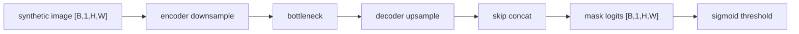

# Vision Practice 04. U-Net Segmentation 코드 학습 가이드

- 대상 원본: `vision/04_Unet.ipynb`
- 목표: Synthetic circle segmentation 데이터에서 U-Net encoder/decoder와 skip connection이 픽셀별 mask logits를 만드는 과정을 이해한다.

## 1. 전체 흐름

## 2. Shape / 데이터 구조 표

| 객체 | shape / 구조 | 의미 |
|---|---:|---|
| `image` | `[B,1,H,W]` | 입력 grayscale image |
| `mask` | `[B,1,H,W]` | 정답 binary segmentation |
| `encoder feature` | `[B,C,H/2^k,W/2^k]` | downsample된 context |
| `skip feature` | `[B,C,H/2^k,W/2^k]` | decoder에 concat할 위치 정보 |
| `logits` | `[B,1,H,W]` | 픽셀별 foreground 점수 |
| `prob mask` | `[B,1,H,W]` | sigmoid 후 확률 |

## 3. Cell range map

| 셀 | 역할 | 보는 것 |
|---:|---|---|
| 0-2 | setup/import | torch, matplotlib, device 준비 |
| 3-4 | SyntheticCircleDataset | 입력 이미지와 원형 mask 생성 |
| 5-6 | U-Net 모델 구현 | DoubleConv, Down, Up, skip concat |
| 7-12 | loss/train/eval | BCEWithLogitsLoss와 loss curve |
| 13-14 | 예측 시각화 | sigmoid+threshold로 mask 비교 |

## 4. Cell-by-cell 학습 메모

### Cells 0-2 — setup/import
- 핵심 관찰: torch, matplotlib, device 준비
- 실행 결과보다 “어떤 객체가 다음 단계 입력이 되는가”를 먼저 확인한다.

### Cells 3-4 — SyntheticCircleDataset
- 핵심 관찰: 입력 이미지와 원형 mask 생성
- 실행 결과보다 “어떤 객체가 다음 단계 입력이 되는가”를 먼저 확인한다.

### Cells 5-6 — U-Net 모델 구현
- 핵심 관찰: DoubleConv, Down, Up, skip concat
- 실행 결과보다 “어떤 객체가 다음 단계 입력이 되는가”를 먼저 확인한다.

### Cells 7-12 — loss/train/eval
- 핵심 관찰: BCEWithLogitsLoss와 loss curve
- 실행 결과보다 “어떤 객체가 다음 단계 입력이 되는가”를 먼저 확인한다.

### Cells 13-14 — 예측 시각화
- 핵심 관찰: sigmoid+threshold로 mask 비교
- 실행 결과보다 “어떤 객체가 다음 단계 입력이 되는가”를 먼저 확인한다.

## 5. 꼭 붙잡을 개념

- Segmentation은 이미지 전체 class가 아니라 픽셀마다 foreground/background를 맞히는 문제다.
- skip connection은 downsample로 잃기 쉬운 위치 정보를 decoder에 되돌려 준다.
- BCEWithLogitsLoss는 sigmoid를 내부에 포함하므로 학습 전 logits에 sigmoid를 먼저 적용하지 않는다.

## 6. 실수 포인트

- mask dtype/shape가 logits [B,1,H,W]와 맞아야 한다.
- threshold 0.5는 기본값일 뿐이며 데이터/목표에 따라 조정 가능하다.
- upsample 후 skip feature와 spatial size가 맞지 않으면 concat 오류가 난다.

## 7. 복습 체크리스트

- `image`의 `[B,1,H,W]`가 어느 단계에서 만들어지고 다음 단계에서 어떻게 쓰이는지 설명할 수 있는가?
- `mask`의 `[B,1,H,W]`가 어느 단계에서 만들어지고 다음 단계에서 어떻게 쓰이는지 설명할 수 있는가?
- `encoder feature`의 `[B,C,H/2^k,W/2^k]`가 어느 단계에서 만들어지고 다음 단계에서 어떻게 쓰이는지 설명할 수 있는가?
- `skip feature`의 `[B,C,H/2^k,W/2^k]`가 어느 단계에서 만들어지고 다음 단계에서 어떻게 쓰이는지 설명할 수 있는가?
- notebook을 실행하지 않아도 전체 data flow를 그림으로 다시 그릴 수 있는가?
